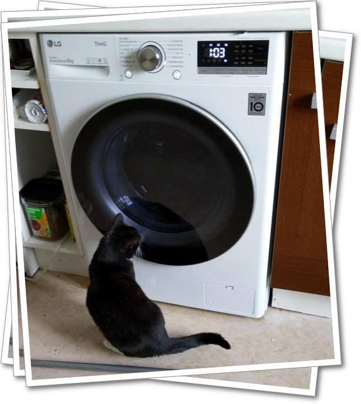
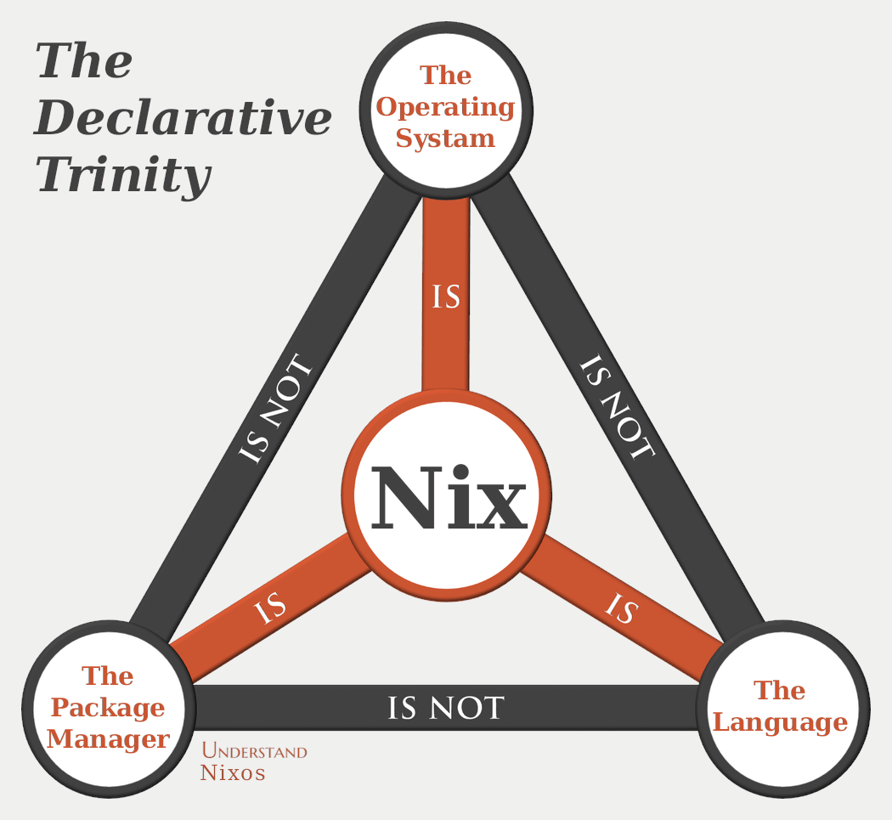
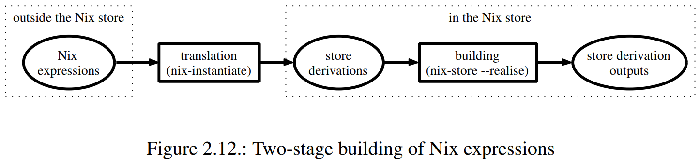
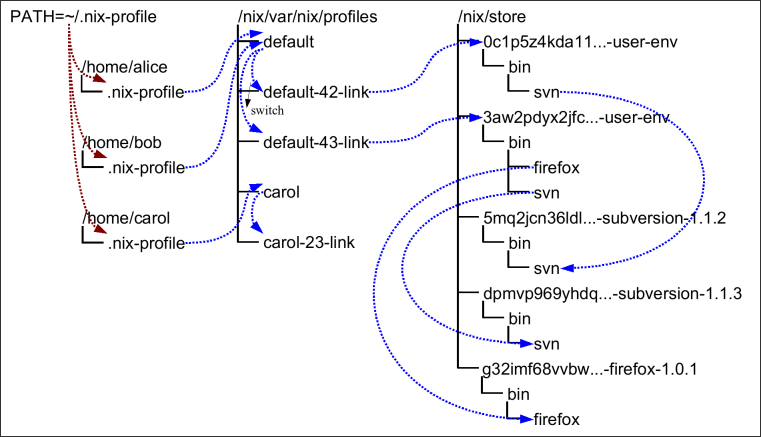

## DECLARATIVE AND REPRODUCIBLE </br> *DEVELOPER* <!--red--> *ENVIRONMENTS* <!--red--> USING *NIX* <!--red-->
<!--fit-->

 <!-- .element width="233px" -->

Scandio 2023, *Christoph Piechula*, (<!--rev-->) <!--red-->
<br>build with ❤️, <!--nix--> and <!--version-->
<!-- .element: style="font-size: 0.50em" -->

---

### What is this? <!--slideani-->


 <!-- .element width="350" -->


This is how it feels to encounter Nix for the first time. <!--frag-->

---

### Just a side note... <!--slideani-->

- Nix has a steep learning curve <!--frag-->
- It will be a lot of new information 🤯 <!--frag-->
- It is not important to get everything in detail
<!--frag-->

**Goal**: You understand the basic idea behind Nix and can use it for your
daily work to manage **systems** and **developer environments** declaratively.

<!--frag-->

 <!-- .element width="200" -->


Note: It is not important that you understand that you understand all details

---

### Just a side note... <!--slideani-->

- Nix has a steep learning curve
- It will be a lot of new information 🤯
- It is not important to get everything in detail

**Goal**: You understand the basic idea behind Nix and can use it for your
daily work to manage **systems** and **developer environments** declaratively.

 <!-- .element width="200" -->

Note: It is not important that you understand that you understand all details

---


### What are we going to talk about... <!--fit-->

- Basic concepts behind Nix(OS)
- What are Nix Flakes
- Environment management with Nix
- Developer environments with Nix

---


### Once upon a time... <!--slideani-->

 <!-- .element width="300" -->

---

### Once upon a time... <!--slideani-->

Nix started as a research project at University Utrecht by Eelco Dosltra ([The
Purely Functional Software Deployment Model](https://edolstra.github.io/pubs/phd-thesis.pdf)).

 <!-- .element width="300" -->

---

### Once upon a time... <!--slideani-->


- 2003: First Nix commit
- 2006: NixOS by Armijn Hemel
- 2007: NixOS becomes usable + x86_64 support
- 2015: NixOS Foundation + First NixCon (Berlin)
- 2021: Nix command and flakes introduced
- Since some years rapidly growing community

---


### Demystifying Nix

There is often some confusion about what **nix** is:

<!--left-->

</br>

- Nix Package Manager
- Nix Expression Language
- NixOS

<!--div--> <!--right-->

 <!-- .element width="450" style="border-radius: 7px"-->

<!--div-->

---


### Why Nix(OS)?

Some of the problems nix manages to solve: <!--frag-->

- Upgrades alter global state <!--frag-->
- Complex software environments <!--frag-->
- „Works on my machine“ issue <!--frag-->
- Package and dependency conflicts <!--frag-->
- No safe possibility to rollback <!--frag-->
- No configuration management <!--frag-->

---


### What Nix provides

- Reproducible builds and environments
- Isolation and encapsulation
- Completely declarative systems
- Rollbacks

The good thing is: **Nix** runs on Linux, MacOS and Windows WSL.

Note:
- Functional
- Different software versions at the same time

---


### Core components

- Nix (package manager and build tool)
- Nix Expression Language
- Nix Packages Collection (nixpkgs)
- NixOS (Linux Distribution based on Nix)

---

### 📦 NIX PACKAGE MANAGER <!--fit-->

---

### Note about installing nix <!--slideani-->

There are two nix installers around.

🤯🤪🪲

The [nixos.org](https://nixos.org/download.html) installer (without uninstaller).

To enable [nix-command](https://nixos.wiki/wiki/Nix_command) interface and [flakes](https://nixos.wiki/wiki/Flakes):

```nix
mkdir -p ~/.config/nix
echo 'experimental-features = nix-command flakes' >> ~/.config/nix/nix.conf
```
<!-- .element: style="font-size: 0.45em" -->

---

### Note about installing nix <!--slideani-->

There are two nix installers around.

🤯🤪🪲

The [Determinate Systems (zero-to-nix.com)](https://zero-to-nix.com)
installer which has new [nix-command](https://nixos.wiki/wiki/Nix_command) interface and [flakes](https://nixos.wiki/wiki/Flakes) enabled **by default** and comes **with** a **uninstaller**.

---


### Nix Package Manager old vs new

Demystifying the `nix` commandline 🪲.


<div id="left">

🙀 Old interface

```java
nix-build -A foo
nix-shell -p foo
nix-shell "<nixpkgs>" -A foo
nix-env -iA nixos.foo
nix-env -f . -iA foo
nix-instantiate -A foo
```

</div>

<div id="right">

😻 New with flakes
```java
nix build .#foo
nix shell nixpkgs#foo
nix develop nixpkgs#foo
nix profile install nixpkgs#foo
nix profile install .#foo
nix eval .#foo
```

</div>

Use the new interface with ❄️  support.

---


### How to use the Nix Package Manager <!--fit-->

```java
nix profile install nixpkgs#btop
nix run nixpkgs#btop
nix shell nixpkgs#btop
nix develop nixpkgs#btop
nix build nixpkgs#hello
```

Everything you **install**, **build** or **run** with `nix` ends up in the **nix store**
usually under `/nix/store`.

Note:

- nix-store -q --references result

---


### How nix works <!-- .slide: data-auto-animate -->

- Expression
- Derivation (build task)
- Closure (all deps to build/run package)

 <!-- .element style="border-radius: 7px" -->

Note:

- Packages are defined in **nix expression language**
- Derivation (build task)
- Result of this is the product of the build
- NIX_PATH

---

### How nix works <!-- .slide: data-auto-animate -->

When you install e.g. curl it ends up under a specific path in the nix store.
The **path** is a **cryptographic hash** of **all inputs** involved in building the package
(sources, dependencies, compiler flag...).
<!--fit-->

```java[1-2|4-6|4-10]
$ whereis curl
curl: /nix/store/0xyi7w3cm3g7gzwfpwqzx0n7xks2sdc6-curl-8.0.1-bin/bin/curl

$ nix shell nixpkgs#hello
$ whereis hello
hello: /nix/store/s549276qyxagylpjvzpcw7zbjqy3swj6-hello-2.12.1/bin/hello

$ nix shell nixpkgs/nixos-20.03#hello
$ whereis hello
hello: /nix/store/9pqfirjppd91mzhkgh8xnn66iwh53zk2-hello-2.10/bin/hello
```
<!-- .element: style="font-size: 0.45em" -->


---

### How nix works (profiles)<!-- .slide: data-auto-animate -->

Profiles and user environments allow different configurations:
<!--fit-->

 <!-- .element height="350" style="border-radius: 7px" -->

Profiles are basically symlinks to a certain point of changes. <!--fit-->

---


### 📡 NIX EXPRESSION LANGUAGE <!--fit-->

---

### Nix Expression Language

<!--left-->

- DSL
- Functional
- Pure
- Lazy

<!--div-->

<!--right-->

```nix
let
  f = {a, b}: a + b;
in
  f { a = 1; b = 2; }
3
```

<!--div-->

---

### Nix Expression Language

Package declaration (simplified):

```nix [0|1|3-9|10-12|0]
{ lib, stdenv }:

stdenv.mkDerivation {
  pname = "hello";
  version = "2.12.1";
  src = builtins.fetchTarball {
    url = "mirror://gnu/${pname}/${pname}-${version}.tar.gz";
    sha256 = "1ayhp9v4m43cibrdhjmnl2bq3cibrbqqkgjbl3s7[...]";
  };
  meta = with lib; {
    license = licenses.gpl3Plus;
  };
}
```
<!-- .element: style="font-size: 0.50em" -->

Becomes:
<!--frag-->
```sh
/nix/store/s549276qyxagylpjvzpcw7zbjqy3swj6-hello-2.12.1/bin/hello
```
<!-- .element: style="font-size: 0.45em" -->
<!--frag-->

Note:
domain-specific
declarative
pure
functional
lazy

---


### Nix Expression Language

You can run **nix repl** to get a interactive nix shell:

```nix
nix-repl> f = x: 2 * x + 42
nix-repl> f 42
126
```

Ressources to learn nix expression language: [Nix Reference
Manual](https://nixos.org/manual/nix/stable/language/index.html), [A tour of
Nix](https://nixcloud.io/tour/?id=1) or [Learn X in Y
minutes](https://learnxinyminutes.com/docs/nix/).

Note:
- Add nix eval or nix instantiate

---

## 📦 NIX PACKAGES COLLECTION <!--fit-->

---


### Nix Packages Collection (nixpkgs) <!--fit-->

- Over 80.000 packages ([nixpkgs@github](https://github.com/NixOS/nixpkgs))
- Biggest and most up-to-date repo ([repology](https://repology.org/repositories/statistics/newest))
- Search for packages on [search.nixos.org/packages](https://search.nixos.org/packages)
- Or just:
  ```sh
  nix search nipxkgs neovim
  ```
- Find a specific version of a package ([nix-versions](https://lazamar.co.uk/nix-versions))

---


### DEMO: How to use nix

```java
nix run nixpkgs#hello
nix shell nixpkgs#hello
nix shell nixpkgs/nixos-20.03#hello
nix build nixpkgs#hello
nix develop nixpkgs#hello
nix profile install nixpkgs#hello
```
---

## 🐧❄️ NixOS

---

### NixOS

NixOS is a Linux distribution build upon the Nix package manager.<!--fit-->

- Stable (e.g. 22.11) and unstable channels
- No FHS (Filesystem Hierarchy Standard)
- Atomic system updates and rollbacks by design
- Source and binary based (building and caching)
- Modules, Overlays
- Whole system described as a nix expression

😎 Reliable system, basically **unbreakable by design**.
<!--fit-->

---


### What is NixOS (configuration)

System is described in `/etc/nixos/configuration.nix` </br>
using the Nix Expression Language:

```nix[0|1-3|5-6|8-8|10-13|15-16|18-19]
{
  boot.loader.systemd-boot.enable = true;
  boot.loader.efi.canTouchEfiVariables = true;

  networking.hostName = "nixos-devbox";
  networking.networkmanager.enable = true;

  time.timeZone = "Europe/Berlin";

  users.users.alice = {
    isNormalUser = true;
    extraGroups = [ "wheel" ];
  };

  environment.systemPackages = with pkgs; [ neovim curl jq wget git zsh ];
  services.openssh.enable = true;

  networking.firewall.allowedTCPPorts = [ 22 80 ];
  networking.firewall.enable = true;
}
```
<!-- .element: style="font-size: 0.37em" -->

---

### What is NixOS (modules and options) <!--fit-->

Installing docker means enabling the docker [option](https://search.nixos.org/options) in your `configuration.nix`:

```nix
users.users.alice = {
    [...]
    extraGroups = [ "docker" "networkmanager" "wheel" ];
};

virtualisation.docker = {
    enable = true;
    enableOnBoot = true;
};
# nixos-rebuild switch / test / boot
```


Note:

- Show docker
- Show KDE
- Show Channels
- Show Generations

---

### What is NixOS

To install packages or to change system configuration: <!--fit-->

- Change your `/etc/nixos/configuration.nix`
- Run `nixos-rebuild switch [--upgrade]`
- Done 😎

Module options [search.nixos.org/options](https://search.nixos.org/options)

---


### Nix overlays and overwrites <!--slideani-->

Package overrides:

```nix
nginx-libressl = pkgs.nginx.override {
    openssl = pkgs.libressl;
};

mpv = pkgs.mpv-unwrapped.override {
    sixelSupport = false;
};
```

---


### Nix overlays and overwrites <!--slideani-->

Package overlays:

```nix
final: prev: {

   google-chrome = prev.google-chrome.override {
     commandLineArgs =
       "--proxy-server='https=127.0.0.1:3128;http=127.0.0.1:3128'";
   };
   [...]

};
```
<!-- .element: style="font-size: 0.50em" -->

---


### DEMO TIME

Let's explore NixOS...

---

## ❄️  NIX FLAKES

---

### Nix Flakes

Implements schema with `inputs` and `outputs` and does not relay on system configured `channels`.

- More reproduciblity
- Faster nix shells
- Composable developer shells

Enable the new nix command and flakes four your user: <!--fit-->

```sh
mkdir -p ~/.config/nix
echo 'experimental-features = nix-command flakes' >> ~/.config/nix/nix.conf
```
<!-- .element: style="font-size: 0.45em" -->

---


### Nix Flakes

A flake is defined by a `flake.nix` file:

```nix [0|2-2|3-8|9-15]
{
  description = "A simplified flake"
  # Dependencies of our flake
  inputs = {
    nixpkgs = {
      url = "http://github:nixos/nixpkgs/nixos-unstable";
    };
  };
  # A function that turns our dependencies into packages,
  # developer shells, and other outputs.
  outputs = {self, nixpkgs, ...}: {
     packages = {...};  # nix build .#name
     apps = {...};      # nix run .#name
     devShells = {...};  # nix develop .#
     nixosConfigurations = {...};
  }
}
```
<!-- .element: style="font-size: 0.45em" -->

See Flake schema in [NixOS Wiki](https://nixos.wiki/wiki/Flakes).
https://github.com/NixOS/templates

---

### Nix Flakes

```nix
{
  inputs = {
    nixpkgs.url = "github:nixos/nixpkgs/nixos-unstable";
  };

  outputs = { self, nixpkgs }: {

    nixosConfigurations = {
      alice-nixos = nixpkgs.lib.nixosSystem {
        system = "x86_64-linux";
        modules = [ ./alice/configuration.nix ];
      };
    };
  };
}

```

Use `nixos-rebuild build --flake` or `nix build` to build the whole Linux system.

---

### Flake References

Flakes support different types of references:

```go [1|2|3|4]
nix run github:nixified-ai/flake#invokeai-amd -- --web
nix run nixpkgs#hello
nix build nixpkgs#hello
nix develop .#
```

Here `nixpkgs` is just a symbolic identifier to github nixpkgs repo.

---

### Flake References

Flake registry is a convenience feature to reference to a flake as symbolic link:

```go
$ nix registry list | grep nixpkgs
global flake:nixpkgs github:NixOS/nixpkgs/nixpkgs-unstable
```


You can add your own:

```java
nix registry add lazycats "git+ssh://somewhere/projectx"
nix develop lazycats#run-ci
```

---

### Flake Demo

```java
nix flake show
nix flake check
nix flake metadata

nix build .#hello
nix run .#hello
nix run .#
nix develop .#
nix develop .#hello
```

---

### LET'S FACE REALITY 😳🤯🥹😻

... and go through some real life use cases 🧶

after a **10 minutes break** 😻

---


### This is Ritz<!--slideani-->

Ritz would do everything for food.

<!--right-->

 <!-- .element height="400" -->

<!--div-->

<!--left-->

- Name: Ritz
- Origin: 🇮🇹
- Age: ~ 9 years
- Hobby: Food Quality Check
- Work: MacOS Hipster Cat

<!--div-->

---

### This is Ritz<!--slideani-->

🐱 + 💻 + ☕ = 🔥😿 ? <!--fit-->

---

### This is Ritz<!--slideani-->


Not with Ritz... he claims to setup his MacBook in 1 minute and 23 seconds.
So how does he setup his brand new Macbook in basically no time?

💻 + 🏠 = 😺 <!--frag-->
<!-- .element: style="font-size: 2.50em" -->


---


### Home-manager

Home Manager enables you to manage your user environment declaratively.

🏠

- Declarative management of user profile
- Dotfiles management

---

### Home-manager

Install nix with installer from Determinate Systems:

```sh
curl --proto '=https' --tlsv1.2 -sSf -L https://install.determinate.systems/nix | sh -s -- install
```
<!-- .element: style="font-size: 0.34em" -->

Or use the official [nixos.org](https://nixos.org/download.html) installer. To
enable [nix-command](https://nixos.wiki/wiki/Nix_command) and [flakes](https://nixos.wiki/wiki/Flakes):

```nix
mkdir -p ~/.config/nix
echo 'experimental-features = nix-command flakes' >> ~/.config/nix/nix.conf
```
<!-- .element: style="font-size: 0.45em" -->

---

### Home-manager

Install home-manager:

```sh
nix run home-manager/master -- init --switch ~/home-flake
Creating /Users/ritz/home-flake/home.nix
Creating /Users/ritz/home-flake/flake.nix
[...]
home-manager switch --flake "github:Ritz/dotfiles"
[...]
```

Done 🏠 😎

---


### Home-manager

Structure of a `home.nix` file:

```nix [0|1|3-4|6|8|10-12|14-15]
{ pkgs, ... }:
{
  home.username = "ritz";
  home.homeDirectory = "/Users/ritz";

  programs.git.enable = true;

  home.packages = with pkgs; [ fd btop neovim mpv ];

  home.sessionVariables = {
     EDITOR = "neovim";
  };

  home.stateVersion = "22.11";
  programs.home-manager.enable = true;
}
```

A list with all options can be found
[online](https://rycee.gitlab.io/home-manager/options) or see manpages with
`man home-configuration.nix`.

---

### Demo

Let's check how Ritz can setup his MacBook...

---

## 🐚 DEVELOPER SHELLS <!--fit-->

---


### Developer shells

- Consistent environment for eveybody on the team
- CI for free
- Testing new packages
- Instant onboarding
- Flexible and extensible

---


### A simple developer shell

```nix[0|1|2-12]
{ pkgs ? import <nixpkgs> { } }:
pkgs.mkShell {
  buildInputs = with pkgs; [
    go
    cowsay
  ];
  shellHook = ''
  echo "You entered the go shell with cows"
  '';
 # Content of shell.nix or default.nix
 # Run `nix-shell` to load this shell
}
```

Run `nix-shell` (old interface) to activate the environment.
<!--fit-->

---

### Developer shells with flake

Developer shells with flakes provide you:

- Faster load times
- Automatically pinned with `flake.lock` + `git`
- Accessible through Flake references
- Composable
- Extremely extensible

---

### Developer shell using flakes

```nix
{
  inputs = { nixpkgs.url = "github:nixos/nixpkgs"; };
  outputs = { self, nixpkgs }:
    let
       pkgs = nixpkgs.legacyPackages.x86_64-linux;
    in {
      devShells.x86_64-linux.abc = pkgs.mkShell {
          buildInputs = [ pkgs.cowsay ];
          shellHook = ''
            echo meow | cowsay
          '';
      };
  };
}
```
Run `nix develop .#abc` to enter the shell.

Tipp: You can use `flake-utils` library to simplify flake for use with different architectures.

---

### Developer shell using flakes + direnv <!--fit-->


```sh
$ echo "use flake github:Ritz/gcc-toolchain" > .envrc
$ dirnev allow
```

Every time you enter the folder `direnv` loads the environment automatically for you.

[nix-direnv](https://github.com/nix-community/nix-direnv) is a faster/optimised for nix.

---


### Layered Developer shell using flakes + direnv <!--fit-->

Compose multiple developer environment with flakes + direnv: <!--fit-->

```sh
$ echo "use flake github:Ritz/gcc-toolchain" > .envrc
$ direnv allow
$ echo "use flake github:Ritz/deployment-utils >" >> .envrc
$ direnv allow
```
<!-- .element: style="font-size: 0.45em" -->

---

### This is Povero Mi <!--slideani-->

Street cat that crashed into a car some years ago - you should have seen the car
after the crash.

<!--left-->

 <!-- .element height="350" -->

<!--div-->

<!--right-->

- Name: Povero Mi
- Origin: 🇮🇹
- Age: 12-17 years
- Hobby: Organizer of CFC (Cat Fight Club)
- Work: Ubuntu 18.04 LTS

He loves developer shells...
<!--div-->

---

### DEMO

So let's check Povero Mi's computer...

---


### What is left?

🌶️ Spice up your developer shells/scripts with [gum](https://github.com/charmbracelet/gum).

Developer shells that work with nix flakes underneath:

- [devshell](https://numtide.github.io/devshell/)
- [devbox](https://www.jetpack.io/devbox/)

---


### What is left?

To be honest - a lot!

- [nixos-generators](https://github.com/nix-community/nixos-generators) (rpi image, ec2 image, iso ...)
- Build reproducible docker images ([talk](https://www.youtube.com/watch?v=WP_oAmV6C2U))
- DevOps with nix ([talk](https://www.youtube.com/watch?v=LjyQ7baj-KM))
- Impermanence with nix ([blog](https://guekka.github.io/nixos-server-1/))
- NixOS modules for Darwin ([nix-darwin](https://github.com/LnL7/nix-darwin))
- NixOS modules on any Linux ([system-manager](https://github.com/numtide/system-manager))
- [awesome-nix](https://github.com/nix-community/awesome-nix) list to see what is around

---

### Some final words and tipps...

- Nix has some rough edges (e.g. docs, nix interface)
- It is better to be all in
- It takes time to understand
- Read nix code to understand stuff

My personal tipp: Stay close to the project **core**

---


### How to start and to get help?

- [Zero to nix](https://zero-to-nix.com/)
- [nixos.org](https://nixos.org/learn.html)
- [Nix Pills](https://nixos.org/guides/nix-pills/)
- Awesome [talks](https://www.youtube.com/@matthewcroughan) about what nix can do
- Get inspired by other people [configs](https://github.com/mkantzer/dotfiles)
- [discourse.nixos.org](https://discourse.nixos.org/)

Most important thing: Have fun  😎

---

### References

- [The Purely Functional Software Deployment Model (2006)](https://edolstra.github.io/pubs/phd-thesis.pdf) <!--fit-->
- [Zero to nix](https://zero-to-nix.com/)
- [nixos.org](https://nixos.org/learn.html)

---

### Thanks & meow!

 <!-- .element height="400" -->
 <!-- .element height="350" -->

